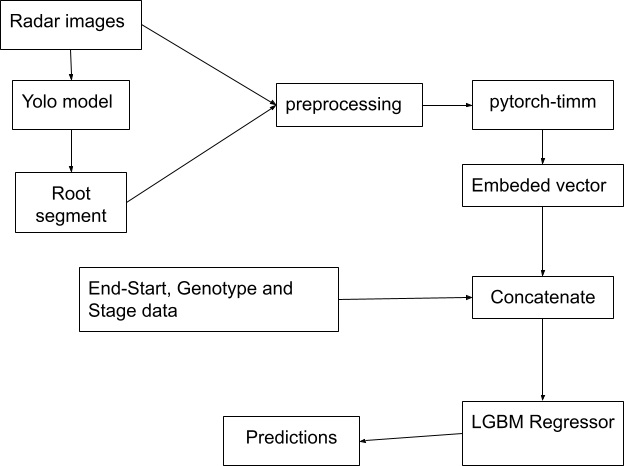
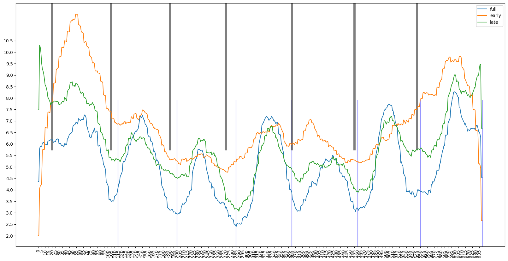
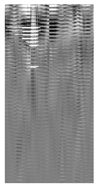

#### **CGIAR Root Volume Estimation Challenge**

**Overview and objectives:**

- The purpose of creating the model is to predict the size of cassava roots based on scan results using Ground Penetrating Radar without having to damage the plants.
- The data provided consists of several varieties, and around 81 layers of radar scan results in the form of images consisting of 7 plants.

**Architecture diagram:**

From the Yolo mask results, by calculate all the segment yolo predictions, I made an estimate of the boundaries between plants 1 to 7. I used these points to cut the image based on the plant number for the model to use to produce image for training and predictions.

*Yolo segment boundary lines based on plant number*

To speed up the process of loading masked images, I put the masking results of all images into a dictionary and save to single pickle file.

For training and prediction, from each radar plant image, I stacked images from “Start” to “Start” + 40 vertically.

Then, I will insert the mask value from yolo into each image by taking the maximum value of each pixel between the original image and the image mask.

I also added a picture of the opposing plant number to the right of the plant picture. The mapping of opposing plant numbers is based on the following pairs:

- 1L and 7R
- 2L and 6R
- 3L and 5R
- 4L and 4R
- 5L and 3R
- 6L and 2R
- 7L and 1R

  *Images used as input for the pytorch-timm model*

  I also combined the tabular values ​​to combine with the image embed values ​​from timm,

  - difference between End and Start,

  - Genotype

  - Stage

  For genotype and stage data, I coded them into numbers.

  **Data modeling:**

  I tried several models to get a lot of insight into which model is the best. I used SVR, LGBM, CatBoost, and NN.

  For fairly good results I tend to SVR and LGBM, I also tried using CNN but the results were not so good.

  For post processing, I calculate the average of each related plant pair and assign it to both plants.

  Model validation uses StratifiedGroupKFold by RootVolume with grouped by FolderName with 5 folds, and CV score is calculated using RMSE.

  Training takes about 10 minutes, and inference takes a total of about 5 minutes.

  The metric I use is RMSE, with 5 StratifiedGroupKFold CV. From the training results, the OOF RMSE I got was 1.45120 with a public score of 1.025004044 and private score of 1.2613859

  Ok, Hopefully the simple illustration above can be useful.
